<div align="center">

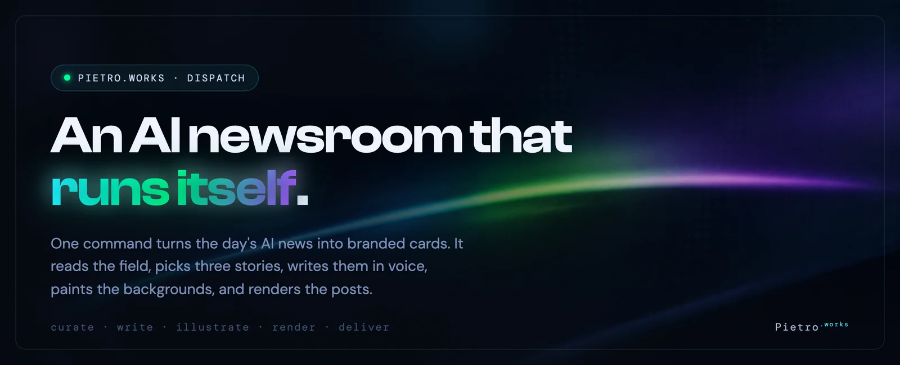

`pietro.works` · automated editorial pipeline


</div>

## What this is

A small machine that does a real editorial job from end to end. Each run it reads the day's AI news, picks the three stories worth posting, writes each one twice in the Pietro.works voice, paints an editorial background for every variation, and renders the finished cards at 2160 square. The output lands in a dated folder, ready to post.

It started as a question I kept hearing in different words: how fast can one person move once the design system, the writing voice, and the rendering are all written down tightly enough that a model can execute them without a human babysitting each step. The answer turned out to be most of a daily content operation, designed and iterated in an afternoon, then left to run on its own.

Nothing on this page is a mockup. The cards below came straight out of the pipeline. So did the header up top and the diagram further down. They were drawn by the same headless browser that renders the cards, which felt like the right way to prove the point.

## The work

<div align="center">

<table>
<tr>
<td>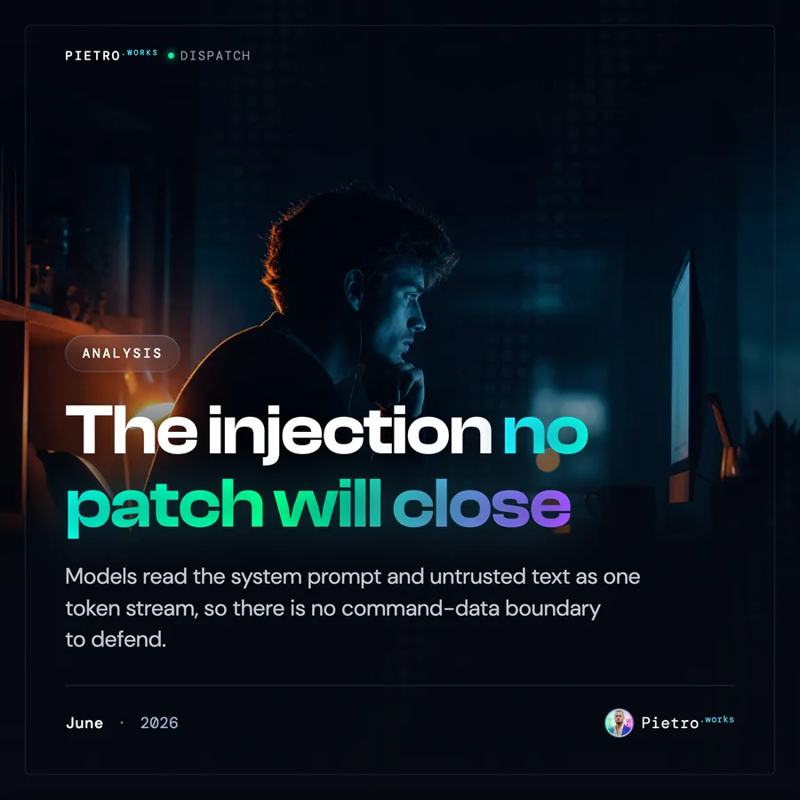</td>
<td>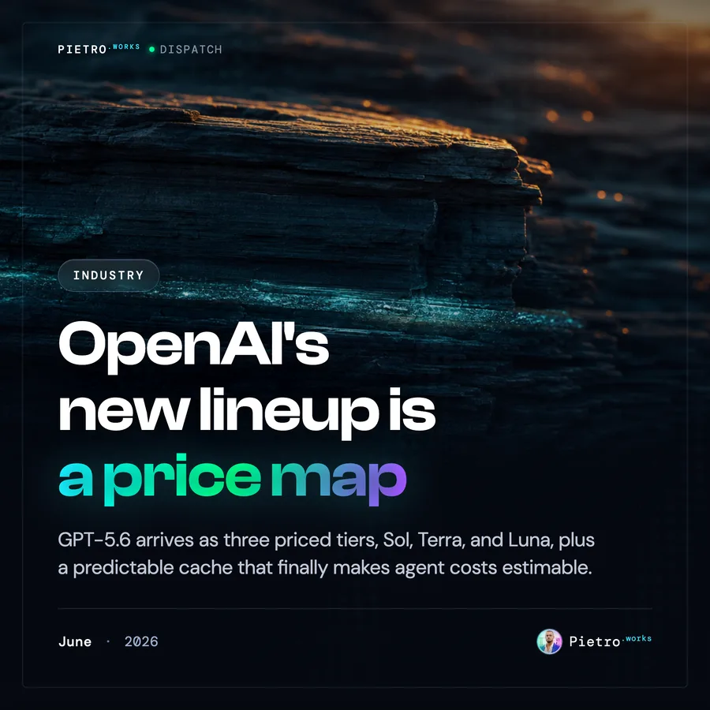</td>
<td>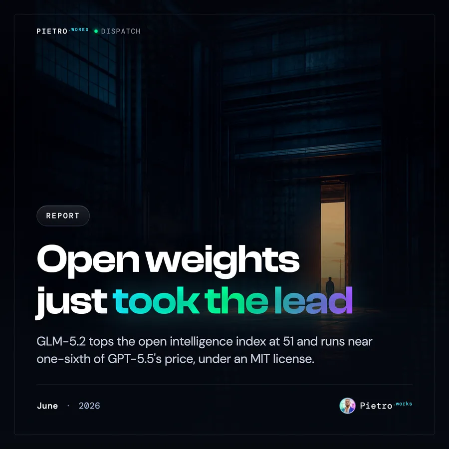</td>
</tr>
<tr>
<td>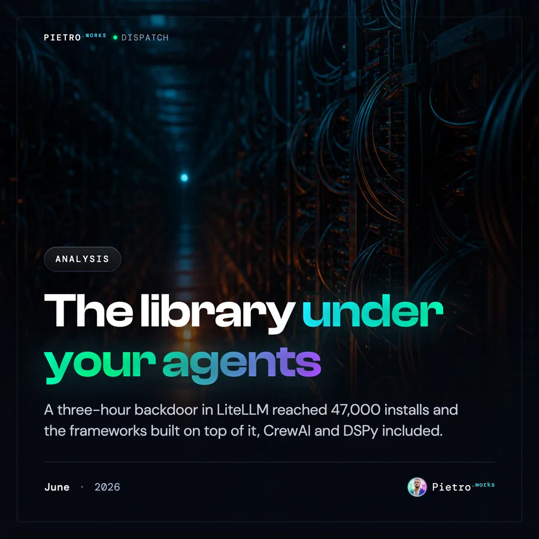</td>
<td>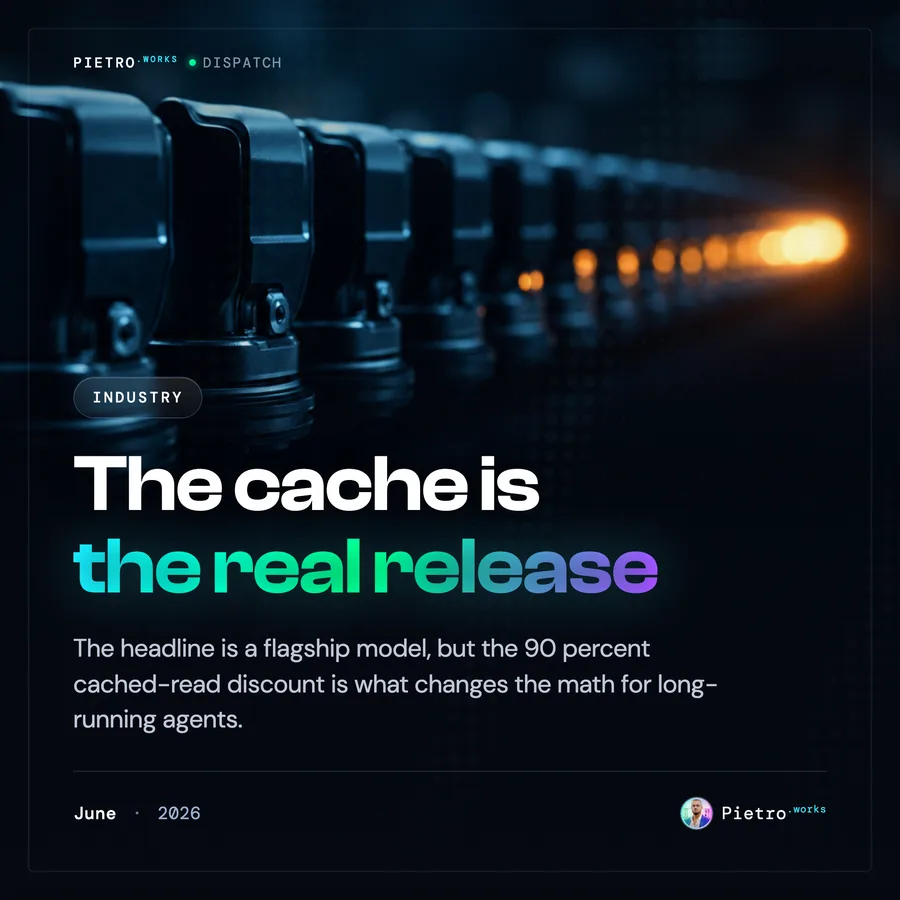</td>
<td>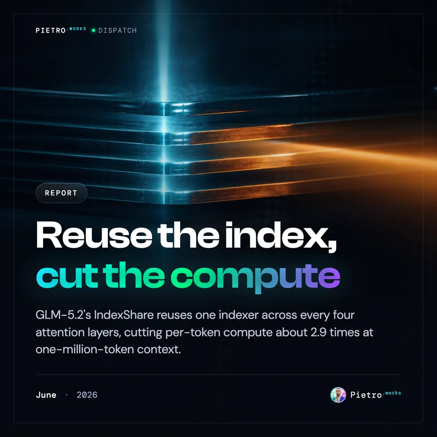</td>
</tr>
</table>

</div>

One day's run. Each column is a story; the top row is the first take, the bottom row the second. The pipeline writes two genuinely different editors on the same news, then leaves the choice to you. Read across the top and you get three angles in a row before any topic repeats, which is how you compare without anchoring on the first thing you saw.

## How it runs

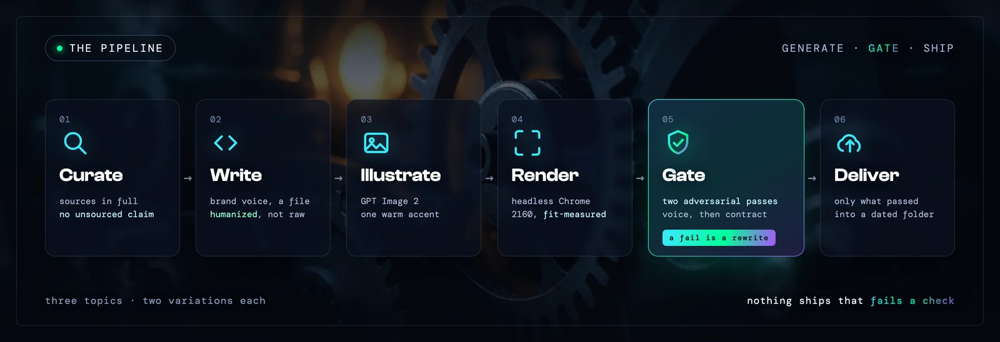

Five moves, one command, laptop closed.

**Curate** reads `sources.yaml` and the open web, fetches the strongest candidates in full so the writing stays grounded, and picks three stories with distinct angles. A funding round with no mechanism under it does not make the cut.

**Write** turns each story into two cards. Same news, different hook, different headline, different image. The voice is not a vibe, it is a file: a long brand-voice spec plus a humanization pass that strips the usual machine tells before anything ships.

**Illustrate** sends each background to GPT Image 2, generated at 1088 square and cropped to a clean 1080. The look is deliberate and covered below.

**Render** is the interesting part, so it gets its own section.

**Deliver** assembles a dated folder, one subfolder per story, with both backgrounds, both finished cards, both paste-ready captions, and the metadata. Then it uploads.

## The renderer

The card template, `news.html`, is the real thing. It is the same brand file used by hand, not a stripped copy made for automation. The renderer drives it in headless Chrome over the DevTools protocol: it serves the template, sets each card's category, headline, and background by calling the template's own functions, runs a fit pass, and screenshots the card element at exactly 2160 by 2160. Every output is checked against that dimension before it is written, so a bad capture fails loud instead of shipping soft.

Two small edits earn their keep. The headline switched to `text-wrap:balance`, which evens the lines and kills a stranded word at the top or bottom in one move. And a guard binds the last two words of every headline with a non-breaking space, so the final line can never collapse to a single orphan. Between them, headlines break cleanly without a human nudging line breaks.

Because this is a real browser rendering real CSS, the cards inherit the brand's actual gradient accent, the Clash Display headline, the dot-matrix texture, and the legibility scrim, with nothing approximated. The same path drew the banner and the diagram on this page.

## The look

The backgrounds follow one rule that does most of the work. Keep the brand's near-black navy and cold cyan, then add a single warm accent on the opposite side of the color wheel: a rim light, a kicker, a backlight, or a motivated source like a lamp or a sliver of golden hour. Warm advances, cool recedes, so that one accent buys depth and separation without busying the frame. It stays small and contained, the single saturated point in an otherwise restrained image. Lively, never loud.

On top of the photograph sits the Pietro.works system: the cyan to green to violet spectrum used as a spotlight rather than wallpaper, monospace metadata, tinted hairlines instead of gray ones, and exactly one glowing accent phrase per card. Premium and exacting, the way a quiet instrument panel reads at night.

## Sliders, the evergreen track

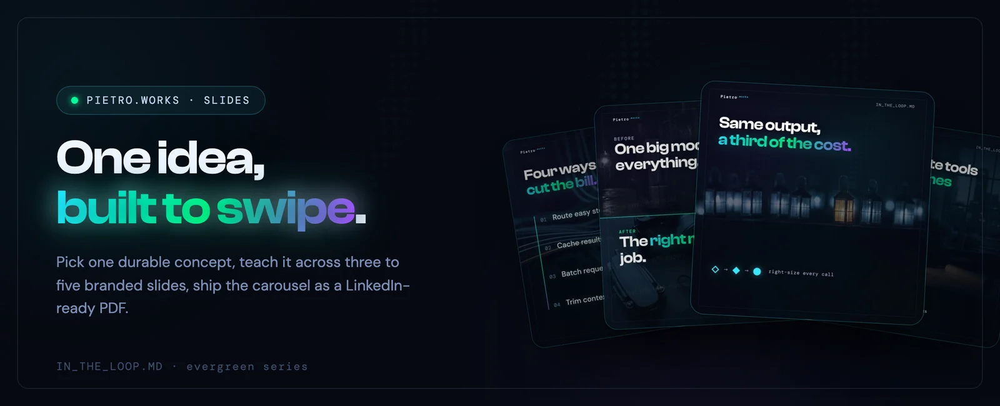

Dispatch chases the day. Sliders does the opposite. It takes one durable idea and teaches it as a short LinkedIn carousel, the kind of post that keeps getting saved months after it goes up. The series is `IN_THE_LOOP.MD`, and a run produces a three to five slide deck plus the caption that sits under it.

It reuses the dispatch image pipeline wholesale, the same `gpt-image-2` backgrounds and the same warm-accent rule, and adds a second renderer, `slides.mjs`, that drives a sibling template through the same headless Chrome. Slides come in four shapes the deck mixes by fit: a hero statement with a glyph row, an ordered steps card, a before-and-after split where the renderer desaturates the *before* so the *after* lands in full color, and a contact close. Once the 2160 slides are rendered it stitches a square PDF, which is what LinkedIn actually wants for a document post. The fonts are self-hosted as woff2 in `renderer/fonts/`, after the CDN versions kept hanging mid-render.

Here is one full `IN_THE_LOOP.MD` deck, on right-sizing your model calls:

<div align="center">

<table>
<tr>
<td>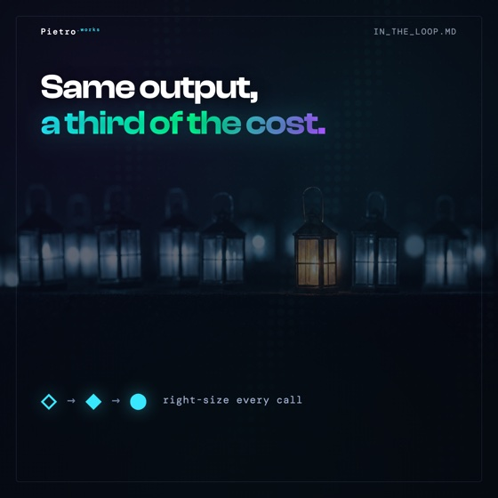</td>
<td>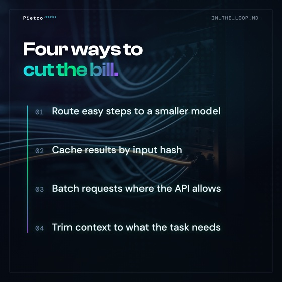</td>
<td>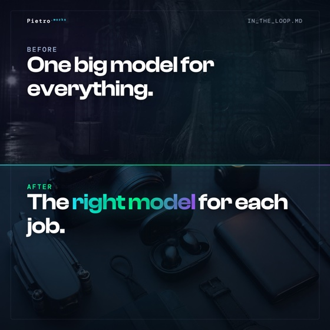</td>
<td>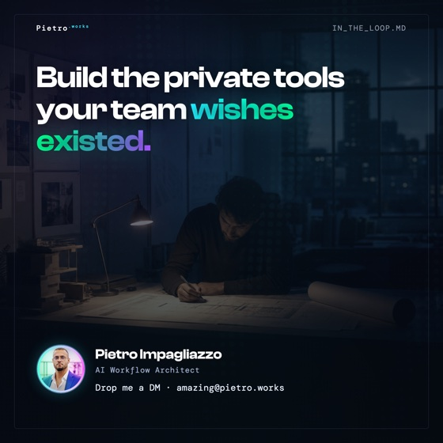</td>
</tr>
</table>

</div>

The deck is also a live component. Open [`docs/sliders-preview.html`](docs/sliders-preview.html) and arrow through it, swipe, or drag. It carries the brand tokens and the gradient accent, with no framework behind it, so it stays a single file you can drop anywhere.

## Scheduling and the queue

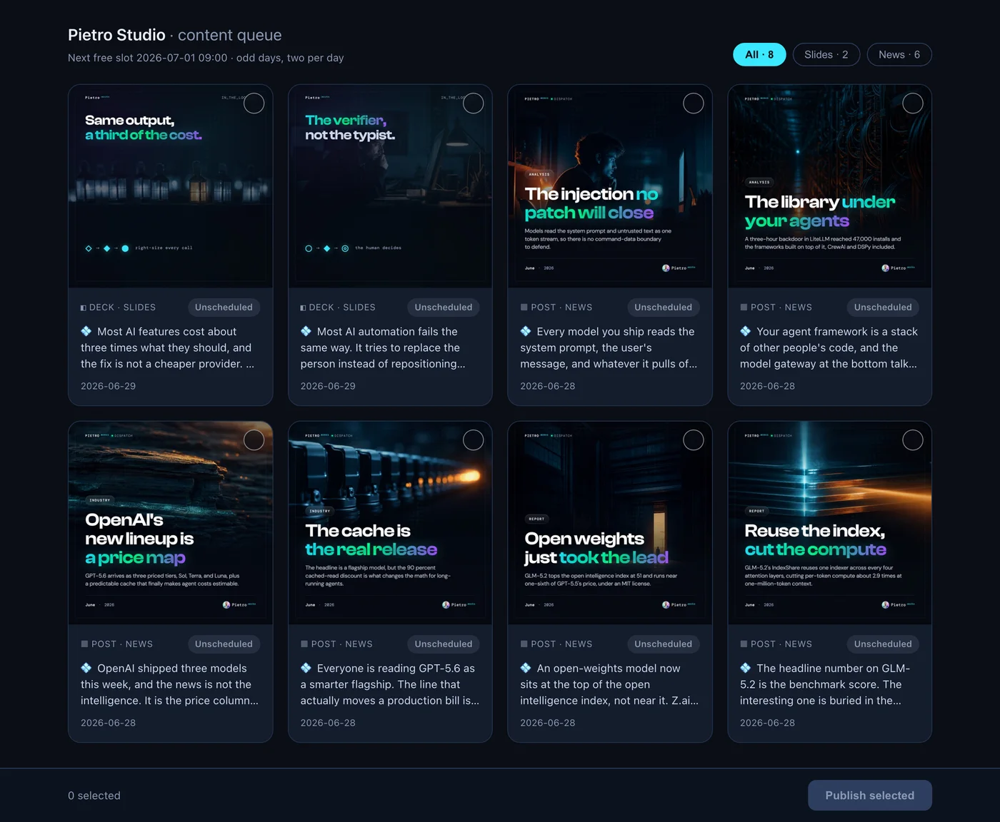

Neither generator waits for someone to press start. Each runs as a scheduled job that fires on its own cadence, builds the dated folder, and drops it in Drive: dispatch on odd days, sliders on a lighter evergreen rhythm.

What comes out flows into a small control room. Studio reads every generated deck and card into one queue, tags each with a status from unscheduled through scheduled to verified, finds the next open slot, and books the approved ones onto LinkedIn. It is a reactive single-page dashboard in the same dark palette as the work it lines up, again with no framework. You pick what ships; the slot engine keeps the calendar.

## Run it yourself

The deterministic half of the pipeline runs from two scripts. Curation and writing are the reasoning layer; these two turn a staged run into finished cards.

```bash
npm install
export OPENAI_API_KEY=...   # the illustrate step needs it; org verification required for GPT Image 2

# given a staged work/<date>/ with prompts.json and cards.json:
node pipeline/generate-images.mjs --in work/<date>/prompts.json --out work/<date>/backgrounds
node renderer/news.mjs --cards work/<date>/cards.json --root work/<date> --out work/<date>/cards
```

The renderer resolves Chrome from `CHROME_BIN` or the usual locations. Fonts load at render time, so there is nothing to install for the type to come out right.

## Layout

```
pietro-dispatch/
  prompts/
    PIETRO_WORKS_VOICE.MD     the brand voice spec
    HUMANIZE.md               the anti-machine-tell pass
    curation.md  generation.md          dispatch: pick and write the stories
    slides-curation.md  slides-generation.md   sliders: pick and design the deck
    slides-sources.yaml       the evergreen scan map
  renderer/
    news.html    news.mjs     dispatch template, 2160 export
    slides.html  slides.mjs   sliders template, 2160 export plus square-PDF stitch
    fonts/                    self-hosted Clash and DM woff2
    *.png/.webp/.avif         render-time brand assets
  pipeline/
    generate-images.mjs       GPT Image 2 backgrounds, shared by both
  .claude/skills/             the dispatch and slides run skills
  sources.yaml                the dispatch source pool
  docs/
    sliders-preview.html      the live, swipeable deck
    assets/                   the images on this page
```

## Status

Both generators run on a schedule now, dispatch on odd days and sliders on an evergreen rhythm, each firing locally and delivering to Drive without a hand on it. Built and refined as a study in AI-assisted rapid iteration: encode the taste once, then let the machine do the repetitive part and keep the human on the decision.

---

<div align="center">

Designed, written, and rendered for **Pietro<sup>.works</sup>**. The brand system is proprietary; the pipeline is shared as a reference build.

</div>
